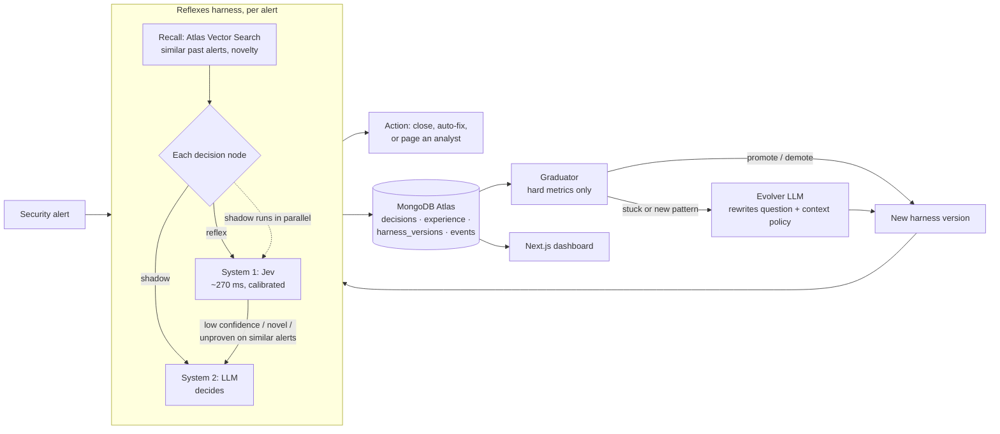

# Reflexes

**Agents that grow reflexes.** An agent harness that learns from its own experience and moves each decision from a slow LLM to a ~300 ms System One reflex once the decision has proven reliable. It demotes and rewrites that reflex when the world changes. The longer it runs, the faster and cheaper it gets, without losing accuracy.

- **Demo video (1 min):** TODO
- **Live dashboard (replays a recorded run):** TODO
- Built solo at the MongoDB x Cerebral Valley *Harness Engineering & Model Wrangling* hackathon, NYC, Sep 26 2026.
- **Tracks:** Recursive Harnessing (primary), Long Horizon Engineering (secondary).

## The problem

When you learned to drive, you thought hard about every mirror check. A year later it was a reflex. AI agents never make that jump.

Inside an agent, most steps are small, repeated decisions: what kind of event this is, how severe it is, whether it's a false positive, which playbook to run. Today every one of them goes through a multi-second LLM call, **forever**. At production volume that means seconds of latency per task, a bill that grows with every request, and, in a security operations center (SOC) during an alert storm, **a real intrusion waiting in a queue behind hundreds of noisy alerts.**

The usual fix is manual. Engineers hand-pick which steps to move to cheaper models, run offline evals, and hope nobody notices when the traffic changes.

## What Reflexes does

The demo agent triages security alerts. Every alert passes through six decisions: **attack type, severity, false positive?, page an analyst?, playbook, safe to auto-fix?** Reflexes wraps each decision point and manages it on its own:

1. **Shadow.** A decision starts on System 2, an LLM with structured output. Jev, TypeSafe AI's [System One model](https://typesafe.ai/blog/introducing-system-one-models-and-jev), answers the same typed question in parallel. It returns calibrated probabilities in about 270 ms and generates no text. Every outcome is written to MongoDB.
2. **Graduate.** When Jev agrees with the LLM on at least 90% of the last 20 decisions, the decision point is promoted to a **reflex**. The harness then sets its own **confidence floor** from Jev's calibration history: the lowest confidence above which agreement stays at 95% or more.
3. **Recall before acting.** Before a reflex fires, **Atlas Vector Search** recalls the most similar past alerts from experience memory. A reflex acts only if the alert looks like something the harness has seen and the reflex proved reliable on those similar alerts. Otherwise the decision goes back to the LLM. *Reflexes only fire where they've earned trust.*
4. **Audit.** A sample of reflex decisions is re-checked by the LLM in the background.
5. **Demote and rewrite.** When a new pattern appears, confidence and audit agreement drop and the reflex is demoted. The **evolver** then rewrites the reflex's own question, adding the categories the LLM kept proposing and changing which inputs the reflex sees. It does this from a Vector Search cluster of the problem cases. The node relearns in shadow and graduates again.

Every change is saved as a new **harness version** in MongoDB, with its parent and the reason for the change.

## Results

TODO, from the final recorded run (450 alerts; the AI-agent-attack campaign starts at alert #246):

| Metric | Start (all on LLM) | End | Change |
| --- | --- | --- | --- |
| Decision time per alert | TODO | TODO | TODO |
| Time to triage, including queue | TODO | TODO | TODO |
| Cost per 1,000 alerts | TODO | TODO | TODO |
| Accuracy vs ground-truth labels | TODO | TODO | TODO |
| Decisions handled by reflexes | 0% | TODO | |

The ground-truth labels are never shown to the engine. It only learns from the LLM and from its own audits. The labels exist only to show that accuracy holds.

## Architecture



## How MongoDB is used

| Feature | Role |
| --- | --- |
| **Documents, versioned** | The harness itself (decision graph, reflex questions, context policies, thresholds) is a document. Each change creates a new version with its parent and the reason, so the harness has a full lineage and can be rolled back. |
| **Vector Search, Automated Embedding** | The `experience` collection is embedded by Atlas (`voyage-4-lite`) with no embedding code. `$vectorSearch` takes plain text and powers novelty detection, the per-reflex "proven on similar alerts" trust check, and the evolver's example cluster. |
| **Decision memory** | Every System 1 and System 2 answer, with its confidence, fallback reason and audit result. This is what reflexes are learned from, and it's the audit trail. |
| **Aggregation, window functions** | `$setWindowFields` computes the rolling latency, cost, accuracy and reflex share behind the dashboard. |

## Model wrangling

All models go through **one OpenRouter key**:

- **System 1:** Jev (`jev-1.13`) through OpenRouter's System One endpoint. One fan-out call answers all six typed questions (choice, score, yes/no) with calibrated probabilities.
- **System 2:** `openai/gpt-5.4-mini`, with structured output through the Vercel AI SDK.
- **Evolver:** `anthropic/claude-sonnet-5`. Called rarely, only to rewrite a reflex.

The harness decides, **per decision point and per alert**, which system answers.

## How this fits the tracks

- **Recursive Harnessing.** The harness evolves its own architecture:
  - It rewires which system handles each decision.
  - It rewrites its reflex questions and adds categories.
  - It changes each reflex's context policy.
  - It sets its own guardrails: confidence floors, novelty fallback and audits.
- **Long Horizon Engineering.**
  - The system is built to run continuously.
  - Experience accumulates in MongoDB and is compressed into reflexes, so memory doesn't depend on the context window.
  - Every promotion is driven by hard metrics (agreement, calibration, audits).
  - Drift is caught automatically.

## Honest limits

- Reflexes can only be as good as their teacher. The held-out labels check this, and human labels could feed the same memory.
- The alerts are synthetic: 450 alerts generated from labeled specs so accuracy can be measured. The engine itself doesn't depend on the workload.
- Deterministic facts (asset criticality, privileged user, threat-intel match) are computed in code and passed in, because Jev isn't built for math or date reasoning.

## Run it locally

```bash
cp .env.example .env.local     # MONGODB_URI (Atlas), MONGODB_DB, OPENROUTER_API_KEY, ALLOW_RUN=1
npm install
npm run jev                    # Jev connectivity check
npx tsx scripts/index.ts       # create the auto-embedding vector index
npm run seed                   # load the 450 labeled alerts (cached in data/alerts.json)
npm run run                    # stream the alert storm through the harness
npm run dev                    # dashboard at http://localhost:3000
```

## Built with

MongoDB Atlas (Vector Search, Automated Embedding) · TypeSafe AI Jev · OpenRouter · Vercel AI SDK · Next.js · Vercel

## Team

- Amey Borkar
