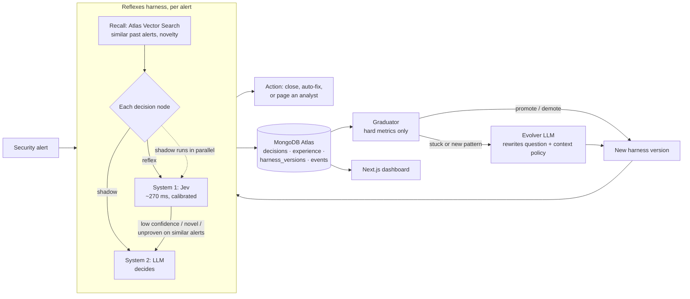

# Reflexes

**Agents that grow reflexes.** An agent harness that learns from its own experience and moves each decision from an LLM to a System One reflex (about 250 ms for an all-reflex alert) once the decision has proven reliable. It demotes and rewrites that reflex when the world changes. In our run it cut cost per alert 2.6× for a 4-point accuracy trade, and it taught itself a new attack category when a campaign appeared.

- **Demo video (1 min):** TODO
- **Live app:** TODO. `/` is the Reflexes console: Overview, Decisions, Memory, Harness history, and **Try it**, where you paste an alert and the learned harness triages it live. `/tour` is a six-chapter product tour.
- Built solo at the MongoDB x Cerebral Valley *Harness Engineering & Model Wrangling* hackathon, NYC, Sep 26 2026.
- **Tracks:** Recursive Harnessing (primary), Long Horizon Engineering (secondary).
- **Docs:** [High-level design](docs/HLD.md) · [Low-level design](docs/LLD.md) · [Demo guide](docs/DEMO.md)

## The problem

When you learned to drive, you thought hard about every mirror check. A year later it was a reflex. AI agents never make that jump.

Inside an agent, most steps are small, repeated decisions: what kind of event this is, how severe it is, whether it's a false positive, which playbook to run. Today every one of them goes through a multi-second LLM call, **forever**. At production volume that means seconds of latency per task, a bill that grows with every request, and, in a security operations center (SOC) during an alert storm, **a real intrusion waiting in a queue behind hundreds of noisy alerts.**

The usual fix is manual. Engineers hand-pick which steps to move to cheaper models, run offline evals, and hope nobody notices when the traffic changes.

## What Reflexes does

The demo agent triages security alerts. Every alert passes through six decisions: **attack type, severity, false positive?, page an analyst?, playbook, safe to auto-fix?** Reflexes wraps each decision point and manages it on its own:

1. **Shadow.** A decision starts on System 2, an LLM with structured output. Jev, TypeSafe AI's [System One model](https://typesafe.ai/blog/introducing-system-one-models-and-jev), answers the same typed question in parallel. It returns calibrated probabilities in about 270 ms and generates no text. Every outcome is written to MongoDB.
2. **Graduate, calibrated.** The harness looks at the last 20 shadow decisions. It finds the lowest Jev confidence at which Jev agrees with the LLM on at least 97% of the cases above it, covering at least 60% of cases. If such a floor exists, the decision point is promoted to a **reflex** with that **confidence floor**, for example: "agrees 100% on the 80% of cases it is confident about (floor 0.86)".
3. **Recall before acting.** Before a reflex fires, **Atlas Vector Search** recalls the most similar past alerts from experience memory. A reflex acts only if the alert looks like something the harness has seen and the reflex proved reliable on those similar alerts. Otherwise the decision goes back to the LLM. *Reflexes only fire where they've earned trust.*
4. **Audit.** About 8% of alerts have their reflex decisions re-checked by the LLM in the background, off the latency path. Audit cost is included in the cost figures.
5. **Demote and rewrite.** When a new pattern appears, confidence and audit agreement drop and the reflex is demoted. The **evolver** then rewrites the reflex's own question, adding the categories the LLM kept proposing and changing which inputs the reflex sees. It does this from a Vector Search cluster of the problem cases. The node relearns in shadow and graduates again.

Every change is saved as a new **harness version** in MongoDB, with its parent and the reason for the change.

## Results

From the final recorded run: 360 alerts, with the AI-agent-attack campaign starting at alert #246. The teacher is `openai/gpt-5.4-mini`. All numbers come straight from MongoDB.

| Phase | Decision time | Cost per 1,000 alerts | Accuracy vs labels | Decisions on reflex | Alerts with no LLM call |
| --- | --- | --- | --- | --- | --- |
| Start: everything on the LLM (first 20 alerts) | 886 ms | $1.03 | 95.8% | 0% | 0% |
| **Graduated, before the campaign (100–245)** | 791 ms | **$0.40 (2.6× lower)** | **91.8%** | 81% | 38% |
| New campaign, before the rewrite (246–324) | 1,009 ms | $0.87 | 80.6% | 62% | 1% |
| After the harness added a category (325–359) | 910 ms | $0.96 | 80.0% | 63% | 11% |

- **Alerts decided entirely by reflexes take 257 ms (median), versus 890 ms on the LLM: 3.5× faster.** In an earlier run with a frontier teacher (Claude Sonnet 5), it was 238 ms versus about 2.4 s, 10× faster.
- **All six decision points graduated by alert #24.** Each one set its own confidence floor, between 0.65 and 0.91.
- **The harness rewrote its own questions three times.**
  - "Page analyst?": demoted at #54, rewritten at #71, re-graduated at #93 with 100% coverage.
  - "Severity": demoted by audits at #245, rewritten at #267, re-graduated at #291.
- **Drift:** Atlas Vector Search flagged the campaign's alerts as unlike anything in memory (#261, #270, #282), and they were handed to the LLM. Jev's confidence on "attack type" collapsed, so the harness demoted it at #294. It then **added a new category, `ai_agent_prompt_injection`,** at #325 and re-graduated at #347.
- 16 harness versions are stored in MongoDB, each with its parent and the reason for the change.

**Honest caveats**

- Average decision time only improves about 10%. When a reflex isn't confident, Jev runs first and then the LLM, so those alerts are slower than using the LLM alone. The fix is to start the LLM in parallel for nodes with low recent confidence.
- Accuracy on reflexes dips about 4 points before the drift. The engine never sees the labels; it only learns from the LLM and its own audits.
- The run ends 35 alerts after the new category appears, so full recovery isn't shown.

## Architecture



## How MongoDB is used

| Feature | Role |
| --- | --- |
| **Documents, versioned** | The harness itself (decision graph, reflex questions, context policies, thresholds) is a document. Each change creates a new version with its parent and the reason, so the harness has a full lineage and can be rolled back. |
| **Vector Search, Automated Embedding** | The `experience` collection is embedded by Atlas (`voyage-4-lite`) with no embedding code. `$vectorSearch` takes plain text and powers novelty detection, the per-reflex "proven on similar alerts" trust check, and the evolver's example cluster. |
| **Decision memory** | Every System 1 and System 2 answer, with its confidence, fallback reason and audit result. This is what reflexes are learned from, and it's the audit trail. |
| **Aggregation, window functions** | `$setWindowFields` computes the rolling latency, cost, accuracy and reflex share behind the dashboard. |

## Model wrangling

All models go through **one OpenRouter key**:

- **System 1:** Jev (`jev-1.13`) through OpenRouter's System One endpoint. One fan-out call answers all six typed questions (choice, score, yes/no) with calibrated probabilities.
- **System 2 (teacher):** `openai/gpt-5.4-mini`, with structured output through the Vercel AI SDK. An earlier run used `anthropic/claude-sonnet-5`.
- **Evolver:** `anthropic/claude-sonnet-5`, with reasoning off. Called rarely, only to rewrite a reflex (at most 2 rewrites per decision).

The harness decides, **per decision point and per alert**, which system answers.

## How this fits the tracks

- **Recursive Harnessing.** The harness evolves its own architecture:
  - It rewires which system handles each decision.
  - It rewrites its reflex questions and adds categories.
  - It changes each reflex's context policy.
  - It sets its own guardrails: confidence floors, novelty fallback and audits.
- **Long Horizon Engineering.**
  - The system is built to run continuously.
  - Experience accumulates in MongoDB and is compressed into reflexes, so memory doesn't depend on the context window.
  - Every promotion is driven by hard metrics (agreement, calibration, audits).
  - Drift is caught automatically.

## Honest limits

- Reflexes can only be as good as their teacher. The held-out labels check this, and human labels could feed the same memory.
- The alerts are synthetic: 450 alerts generated from labeled specs so accuracy can be measured. The engine itself doesn't depend on the workload.
- Deterministic facts (asset criticality, privileged user, threat-intel match) are computed in code and passed in, because Jev isn't built for math or date reasoning.

## Run it locally

```bash
cp .env.example .env.local     # MONGODB_URI (Atlas), MONGODB_DB, OPENROUTER_API_KEY, ALLOW_RUN=1
npm install
npx tsx scripts/check.ts       # Atlas + OpenRouter connectivity (prints no secrets)
npm run jev                    # Jev smoke test
npx tsx scripts/index.ts       # create the auto-embedding vector index
npm run seed                   # load the 450 labeled alerts (cached in data/alerts.json)
npm run run -- --limit 360     # stream the alert storm through the harness (resets run collections)
npx tsx scripts/archive.ts reflexes_run4   # archive the run before the next one
npm run dev                    # dashboard at http://localhost:3000
```

**Console:** `/` (run picker in the top bar). **Try it:** `/try?preset=2`. **Product tour:** `/tour` (←/→, or `/tour?ch=5`). **Replay a run:** `/?db=run3&replay=1&speed=2`. **Freeze a moment:** `/?db=run3&at=330&node=category`. Operations and failure modes are covered in [LLD §11–12](docs/LLD.md#11-operations).

## Built with

MongoDB Atlas (Vector Search, Automated Embedding) · TypeSafe AI Jev · OpenRouter · Vercel AI SDK · Next.js · Vercel

## Team

- Amey Borkar
