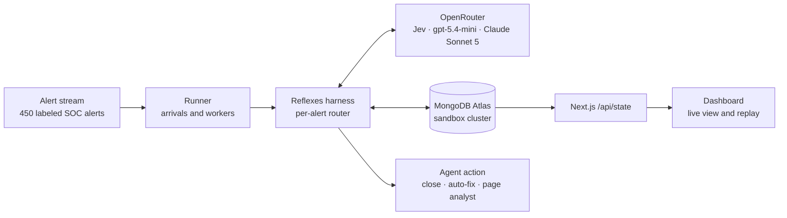
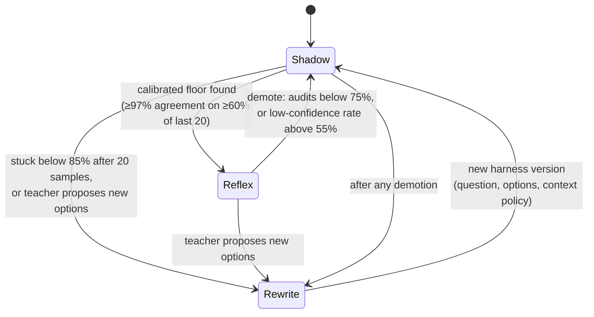
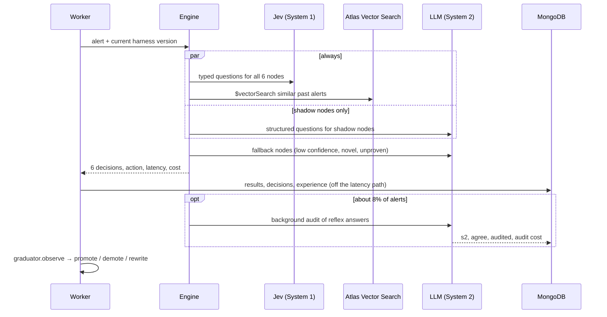
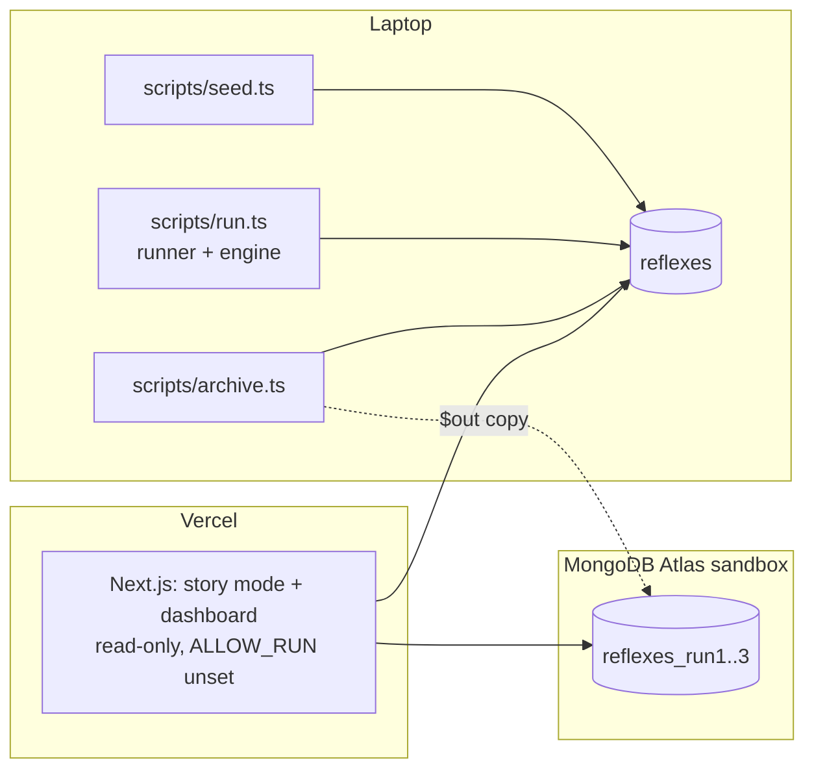

# Reflexes: High-Level Design

Reflexes is an agent harness that moves each decision inside an agent from an LLM ("System 2") to a fast, calibrated System One model ("System 1", TypeSafe AI's Jev) once that decision has proven reliable. It keeps checking the reflex after promotion and demotes it when the world changes. It then rewrites the reflex's own question before promoting it again. MongoDB Atlas stores the harness, every decision, and the experience memory that decides when a reflex may act.

For module-level detail, see [LLD.md](LLD.md). Results are in the [README](../README.md#results).

## 1. Goals and non-goals

**Goals**

- Cut the cost and latency of repeated agent decisions without a training step and without labels.
- Promote a decision only on measured evidence, and reverse it automatically when evidence changes.
- Let the harness change its own structure (routing, questions, categories, context policy, guardrails) and keep a full history of why.
- Make every step observable and replayable for a live demo.

**Non-goals, for the hackathon build**

- Beating the teacher LLM's accuracy. Reflexes can at most match its teacher.
- Real SOC integration. The alerts are a labeled synthetic stream.
- Multi-tenant or horizontally scaled operation. One runner process drives one run.

## 2. System context

- **OpenRouter** is the only model gateway, with one key for all three roles. Jev runs on the System One endpoint; the LLMs run through the Vercel AI SDK.
- **MongoDB Atlas** is the system of record, and its Vector Search is part of the decision path, not just storage.
- **The dashboard** reads MongoDB only. It never calls a model, so the public deployment costs nothing to run.

## 3. Components

| Component | Responsibility | Code |
| --- | --- | --- |
| Harness engine | For each alert, route each of the 6 decisions to System 1 or System 2 and apply the fallback guardrails | `lib/engine.ts` |
| System 1 client | One fan-out call to Jev per context group, returning typed answers with calibrated confidence | `lib/jev.ts` |
| System 2 client | Structured LLM call. It's the teacher and the fallback, and it can propose options the reflex doesn't have. | `lib/system2.ts` |
| Experience memory | Stores every processed alert (auto-embedded by Atlas) and recalls similar past alerts for novelty and per-reflex trust | `lib/memory.ts` |
| Graduator | Turns hard metrics into promote, demote and rewrite decisions | `lib/graduate.ts` |
| Evolver | Rewrites a reflex's question and context policy from problem cases | `lib/evolve.ts` |
| Runner | Drives a run (arrival schedule, worker pool), versions the harness, writes events, applies async audits | `lib/runner.ts` |
| Workload | Decision graph, v0 questions, labels, deterministic facts and actions | `lib/workload.ts`, `scripts/seed.ts` |
| State API, story mode and dashboard | Return a whole run. Story mode (`/`) tells it in six chapters for judges; the dashboard (`/details`) renders it "as of alert N" for live view and replay. | `app/api/state/route.ts`, `app/page.tsx`, `app/details/page.tsx`, `lib/story.ts` |

## 4. Decision-node lifecycle

Each of the six decision points ("nodes") moves through this state machine on its own:

- **Shadow:** System 2 decides, and System 1 answers the same question in parallel so its agreement can be measured.
- **Reflex:** System 1 decides, unless its confidence is below the node's floor, the alert is novel, or the reflex is unproven on similar alerts. In those cases System 2 decides.
- **Rewrite:** the evolver produces a new question. The node restarts in shadow under the new question, and older evidence is discarded. There are at most 2 rewrites per node per run.

## 5. Per-alert flow

## 6. Data stores

All data lives in one Atlas database (`reflexes`). Finished runs are copied to sibling databases (`reflexes_run1`, `reflexes_run2`, `reflexes_run3`) for replay.

| Collection | Purpose |
| --- | --- |
| `requests` | The labeled alert workload (text, facts, truth, batch) |
| `harness_versions` | The harness itself, one document per version, with parent and reason |
| `decisions` | One document per alert × node: both systems' answers, confidence, who decided, audit result |
| `results` | One document per alert: latency, cost, accuracy, reflex share, novelty, action |
| `experience` | Processed alerts with per-node agreement flags; `text` is auto-embedded for Vector Search |
| `events` | Timeline of promotions, demotions, rewrites and novelty flags |
| `runs` | Run metadata and progress |

## 7. Deployment

- The engine runs as a local Node process, because a run is a long job and doesn't fit serverless limits. `POST /api/run` exists for local use only.
- The deployed dashboard is read-only and replays the latest run, or an archived one with `?db=run3`. Finished runs are CDN-cached.

## 8. Key design decisions

| Decision | Why | Trade-off |
| --- | --- | --- |
| Jev as System 1 | Typed answers with calibrated confidence at about 0.3 s and tiny cost. Calibration is what makes automatic promotion safe. | New model (Sep 2026); weak at math and date reasoning, so facts are precomputed in code |
| LLM as label-free teacher | Production has no labels. Agreement with the teacher, plus audits, is the training signal. | Reflexes can't beat the teacher; labels are only used to report accuracy |
| Calibrated promotion (floor plus coverage) | Promote on what the reflex would actually do: agreement on the cases it's confident about | 20-sample windows are small, and the floor is chosen on the same samples it's judged on (optimistic) |
| Vector memory as a trust guardrail | "Only act alone on alerts like ones you've proven yourself on" catches drift before audits do | Novelty separation is modest (similarity about 0.82 for campaign alerts vs about 0.86 for normal ones), which causes occasional false alarms |
| Async audits | Audits stay off the latency path, so an all-reflex alert is fast | Demotion reacts a few alerts late |
| Harness as a versioned document | The full lineage is auditable and replayable, and new fields need no migration | Some thresholds are code constants rather than document fields (see LLD §5) |
| Local runner, read-only web app | Simple, and no serverless time limits | One process; the graduator state is in memory, so a crashed run can't resume |

## 9. Quality attributes

- **Latency:** an all-reflex alert takes about 250 ms (Jev and vector recall run in parallel), versus 0.9 s with gpt-5.4-mini or 2.4 s with Claude Sonnet 5. The average improves much less, because a fallback runs Jev first and then the LLM.
- **Cost:** 2.6× lower per alert in steady state. Audit cost is included. Evolver calls, query embeddings and workload generation are not.
- **Safety:**
  - Confidence floor per node.
  - Novelty and unproven-on-similar-alerts fallbacks.
  - Background audits.
  - Automatic demotion.
  - Deterministic facts.
  - Every decision is logged.
- **Observability:** every version, decision and event is in MongoDB, and the dashboard can replay any moment.
- **Scalability:** this is a demo scale of hundreds of alerts per run. `/api/state` returns a whole run (about 300 KB), which is fine here but would need paging for large runs.

## 10. Known limitations and next steps

1. **Fallbacks are sequential.** Start System 2 in parallel for nodes with low recent coverage, and cancel it if Jev is confident.
2. **Promotion statistics.** Use a held-out split or a Wilson lower bound instead of choosing the floor on the same 20 samples.
3. **Thresholds split between the document and code.** Move `FLOOR_AGREEMENT`, `MIN_COVERAGE` and `AUDIT_RATE` into the harness document so the document is the whole truth.
4. **Workload realism.** The v0 severity, playbook and auto-fix questions already mention AI-agent attacks; only the attack-type taxonomy lacked the category. Real alert data would make the drift test harder.
5. **State durability.** Persist graduator windows so a run can resume after a crash, and namespace `harness_versions` by run instead of wiping it on reset.
6. **Evaluation.** One run per configuration. Repeated runs would give variance.
